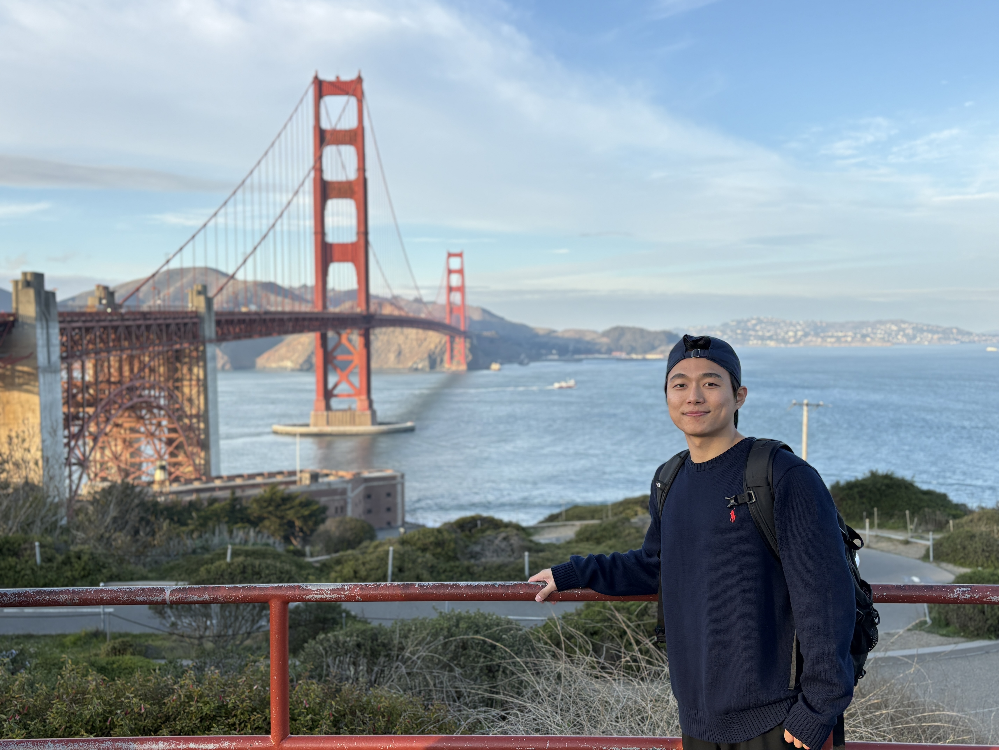

::: {.post-count}
Total posts 
:::

::: {#sidebar-about .sidebar-about}
{.sidebar-about-photo}

**Jiwoo Shin**

Incoming M.S. student at KAIST Graduate School of AI.

Notes on AI research, papers, and everyday things I want to remember.

[More about me →](https://jiwooshin-kr.github.io/)
:::
