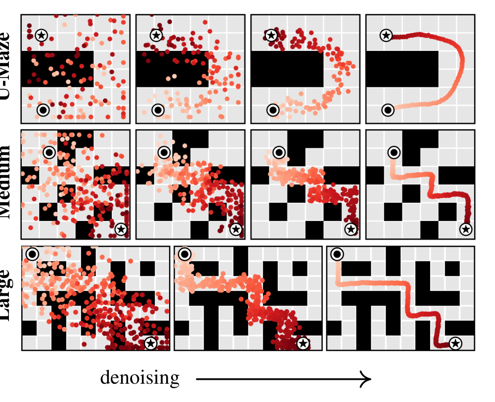

> **Paper:** Michael Janner\*, Yilun Du\*, Joshua B. Tenenbaum, Sergey Levine. *Planning with Diffusion for Flexible Behavior Synthesis.* ICML 2022. [arXiv:2205.09991](https://arxiv.org/abs/2205.09991) · [PMLR](https://proceedings.mlr.press/v162/janner22a.html) · [Project page](https://diffusion-planning.github.io/) · [Code](https://github.com/jannerm/diffuser)

{#fig-teaser fig-alt="Diagram of Diffuser denoising a two-dimensional array of states and actions across the planning horizon, with a local receptive field highlighted and a guide function J injected into the denoising process"}

## TL;DR

Model-based RL usually means: learn a one-step dynamics model, then hand it to a classical trajectory optimizer. In practice the optimizer exploits the model's errors, producing adversarial plans rather than optimal ones. **Diffuser** dissolves the model/planner boundary: train a [denoising diffusion model](https://arxiv.org/abs/2006.11239) directly over *entire trajectories* — a 2D array of states and actions — so that **planning becomes almost identical to sampling**. A plan is not rolled out step by step; it emerges whole, refined from noise over the denoising iterations.

Two conditioning mechanisms make the samples useful for control, both borrowed from image diffusion: rewards enter as [classifier-guided sampling](https://arxiv.org/abs/2105.05233) (gradients of a learned return model nudge the denoising mean), and constraints — most importantly **the initial and final states of the trajectory** — enter as **inpainting**: the constrained entries of the array are simply overwritten with their fixed values after every denoising step, exactly like known pixels in image inpainting. That second mechanism is the answer to a question I had when reading: *can you fix where a generated trajectory starts and ends?* Here it is not a trick bolted on afterwards — it is how every plan is conditioned on the current state, and how goal-reaching is solved with zero reward signal. On the sparse-reward Maze2D benchmark, this start/goal inpainting alone scores **119.5** average (vs 47.0 for the best model-free baseline), and the same trained model transfers to randomized goals *without any retraining* — you just clamp a different terminal state.

## Why this problem matters

Trajectory optimization is the cleanest story in control: write down the objective, let the optimizer find the actions. But it needs ground-truth dynamics $s_{t+1} = f(s_t, a_t)$. The learning-based workaround — approximate $f$ with a neural network, plug it into the optimizer — fails in a characteristic way: powerful optimizers treat model error as opportunity, steering into regions where the learned model hallucinates high reward. So practical model-based RL retreated to weak gradient-free planners, or abandoned planning for value functions.

Diffuser's proposal: if the planner is going to be tightly coupled to the model anyway, design the *model* around the planning problem. Predict full trajectories non-autoregressively (no compounding one-step error), model actions jointly with states (a plan needs both), stay reward-agnostic (one model, many tasks), and make the sampling procedure itself the planner.

## The diffusion model: planning as sampling

**Trajectories as arrays.** Diffuser represents a plan as a two-dimensional array — one column per planning timestep, states stacked on actions:

$$
\tau \;=\;
\begin{bmatrix}
s_0 & s_1 & \cdots & s_T \\
a_0 & a_1 & \cdots & a_T
\end{bmatrix}
$$

The model learns $p_\theta(\tau)$ with a standard diffusion setup ([Sohl-Dickstein et al., 2015](https://arxiv.org/abs/1503.03585); [Ho et al., 2020](https://arxiv.org/abs/2006.11239)): a forward process corrupts trajectories with Gaussian noise over diffusion steps $i = 1,\dots,N$, and a learned reverse process $p_\theta(\tau^{i-1} \mid \tau^i)$ denoises them back. Training is the usual simplified $\epsilon$-prediction objective $\mathcal{L}(\theta) = \mathbb{E}_{i,\epsilon,\tau^0}\big[\lVert \epsilon - \epsilon_\theta(\tau^i, i)\rVert^2\big]$ with a [cosine noise schedule](https://arxiv.org/abs/2102.09672). Notation to keep straight: superscripts are *diffusion* time (noise level), subscripts are *planning* time.

**Why generation must be non-autoregressive.** This is my favorite conceptual point in the paper. Dynamics prediction is causal — the present follows from the past — but *decision-making is anti-causal*: what I should do now depends on where I want to end up. Formally, goal-conditioned inference $p(s_1 \mid s_0, s_T)$ conditions on the future. A left-to-right autoregressive model structurally cannot do this; a diffusion model that generates all timesteps concurrently can. This is precisely the property that makes terminal-state conditioning possible at all — information from the clamped end of the trajectory propagates backwards through planning time during denoising.

**Architecture: local steps, global coherence.** The denoiser is a U-Net of 1D *temporal* convolutions — the image-diffusion U-Net with spatial convolutions swapped for convolutions along the horizon axis. Each denoising step sees only a local temporal receptive field, so a single step can only enforce *local* consistency (do adjacent transitions look dynamically plausible?). Global coherence — a path that actually connects start to goal — emerges from composing many local refinements. Two nice consequences: the model is fully convolutional in time, so the **planning horizon is set by the width of the input noise**, not the architecture (variable-length plans for free); and the local-consistency bias lets Diffuser **stitch** in-distribution trajectory snippets into novel composite plans (trained only on straight-line trajectories, it generalizes to v-shaped ones — Figure 3b).

{#fig-properties fig-alt="Four-panel figure showing denoising toward a goal in a maze, stitching of straight trajectories into v-shapes, variable-length plans from different noise sizes, and planning under a new reward heatmap"}

## Conditioning I: generating the initial and terminal states by inpainting

Sampling from $p_\theta(\tau)$ gives *plausible* trajectories from anywhere to anywhere. Planning needs trajectories that satisfy conditions. Diffuser frames all conditioning as sampling from a perturbed distribution

$$
\tilde{p}_\theta(\tau) \;\propto\; p_\theta(\tau)\, h(\tau),
$$

where $h(\tau)$ carries everything task-specific — and because the dynamics knowledge lives entirely in $p_\theta$, one trained model serves every task in the environment.

The case I want to dwell on — and the reason I picked up this paper — is **hard state constraints: fixing where the trajectory begins and ends.** Section 3.3 observes that with the 2D-array trajectory representation, this is *literally* the inpainting problem from image diffusion: constrained states play the role of observed pixels, and the model must fill in everything else consistently. The perturbation function is a Dirac delta on the constrained entries — for a constraint $c_t$ at planning time $t$:

$$
h(\tau) \;=\; \delta_{c_t}(s_0, a_0, \dots, s_T, a_T) \;=\;
\begin{cases}
+\infty & \text{if } c_t = s_t \\
0 & \text{otherwise}
\end{cases}
$$

The implementation is disarmingly simple. At every denoising step $i \in \{N, \dots, 1\}$:

1. sample $\tau^{i-1} \sim p_\theta(\tau^{i-1} \mid \tau^i)$ as usual;
2. **overwrite the constrained entries with their fixed values** — for start/goal conditioning, $\tau_{s_0} \leftarrow s_{\text{current}}$ and $\tau_{s_T} \leftarrow s_{\text{goal}}$.

Because the clamp is re-imposed after *every* step, the denoiser is repeatedly forced to reconcile the free middle of the trajectory with both fixed endpoints. The anti-causal, bidirectional receptive field is what lets the goal at $t{=}T$ shape the actions at $t{=}0$ — over the denoising iterations, boundary information diffuses inward through planning time until the inpainted middle is a dynamically consistent path connecting the two. Figure 4 makes this visual and is, for me, the most striking figure of the paper: red point-clouds of noise crystallize into a single path pinned at ⦿ and ★.

{#fig-inpainting fig-alt="Grid of maze images across three maze sizes showing scattered red noise points progressively denoising into a single coherent trajectory connecting a fixed start and goal marker"}

Three things worth underlining about this mechanism:

- **It is universal, not optional.** Even pure reward-maximization runs use it — every plan must begin at the *current* state, so $\tau_{s_0} \leftarrow s$ is line 10 of the planning algorithm, executed unconditionally. Terminal-state clamping is the same line applied at the other end. Initial and termination conditions are first-class citizens of the sampler.
- **It generalizes beyond endpoints.** Nothing is special about $t=0$ and $t=T$: any subset of the array can be clamped — intermediate waypoints, even action dimensions (the paper's definition for action constraints is identical). You could pin a mid-trajectory checkpoint just as easily.
- **It is a *hard* constraint, training-free, and retarget-able.** No goal-conditioned training, no reward shaping. The Multi2D experiment is the payoff: the single-task Maze2D model is reused with randomized goals by changing only the clamped value of $\tau_{s_T}$, and performance doesn't move (129.4 vs 119.5). The caveat is the flip side of the same coin: clamping guarantees the endpoints *appear*, but the inpainted middle is only as feasible as the training distribution — clamp an endpoint pair the data never connects, and the model must extrapolate.

## Conditioning II: reward as classifier guidance

For reward maximization, Diffuser ports [classifier-guided sampling](https://arxiv.org/abs/2105.05233) through the [control-as-inference](https://arxiv.org/abs/1805.00909) lens. Let $\mathcal{O}_t$ be the optimality variable with $p(\mathcal{O}_t = 1) = \exp(r(s_t, a_t))$; setting $h(\tau) = p(\mathcal{O}_{1:T} \mid \tau)$ turns RL into conditional sampling. When the guidance term is smooth, the guided reverse step is Gaussian with a shifted mean:

$$
p_\theta(\tau^{i-1} \mid \tau^i, \mathcal{O}_{1:T}) \;\approx\; \mathcal{N}\!\big(\tau^{i-1};\; \mu + \alpha\Sigma\,\nabla\mathcal{J}(\mu),\; \Sigma^i\big)
$$

where $\mathcal{J}_\phi$ is a separately trained return predictor on noisy trajectories, standing in for the image-domain classifier. Guidance and inpainting compose in the same loop — shift the mean by $\alpha\Sigma\nabla\mathcal{J}$, sample, clamp $\tau_{s_0}$, repeat — and multiple guides can be *added* (task compositionality, Figure 3d: a reward function never seen during training steers the same model at test time). Execution is receding-horizon: plan, execute the first action, observe, replan.

## Experiments

**Long-horizon sparse reward (Maze2D / Multi2D).** Reward is 1 only at the goal, hundreds of steps away — a credit-assignment nightmare for model-free RL. Diffuser plans by pure start/goal inpainting (no reward guidance at all) and scores 113.9–123.0 across maze sizes (>100 = better than the reference expert), vs 47.0 average for [IQL](https://arxiv.org/abs/2110.06169) and worse for [CQL](https://arxiv.org/abs/2006.04779) and [MPPI](https://arxiv.org/abs/1509.01149) — the latter *with ground-truth dynamics*, which neatly isolates planning difficulty from model error. In the multi-goal variant, IQL (with hindsight relabeling) drops to 16.9 while Diffuser holds at 129.4, unchanged, because retargeting is just a different clamp.

**Test-time flexibility (block stacking).** One model trained on [PDDLStream](https://arxiv.org/abs/1802.08705) demonstrations handles three tasks by swapping $h(\tau)$: unconditional stacking (no perturbation), conditional stacking and rearrangement (a final-state-matching guide composed with an end-effector contact constraint). Diffuser averages 54.4 where goal-conditioned [BCQ](https://arxiv.org/abs/1812.02900) and CQL score 0.0 — the conditional settings simply break the model-free baselines.

**Offline locomotion (D4RL).** On the [D4RL](https://arxiv.org/abs/2004.07219) MuJoCo suite with reward guidance, Diffuser averages 77.5 — on par with the best purpose-built single-task methods (CQL 77.6, IQL 77.0, [Trajectory Transformer](https://arxiv.org/abs/2106.02039) 78.9, beating [Decision Transformer](https://arxiv.org/abs/2106.01345) 74.7). A telling ablation: using Diffuser merely as a *dynamics model* inside MPPI performs no better than random — the value is in the coupled model-planner, not in prediction accuracy.

**Speed, the honest caveat.** Iterative denoising per plan is slow. Warm-starting helps a lot: re-noise the previous timestep's plan a few steps and re-denoise, cutting the budget ~10× with only a modest score drop (Figure 7). Still, this is 2022-era diffusion sampling — slow relative to a policy forward pass.

## Strengths

1. **A genuinely new abstraction for planning.** "Sampling = planning" is not a slogan here — the planner *is* the sampler plus a perturbation function. This eliminates the model-exploitation failure mode by construction: there is no outer-loop optimizer to adversarially probe the model.
2. **Conditioning by inpainting is elegant and exactly right for goal-reaching.** Hard endpoint constraints, zero retraining, task retargeting by changing one clamped value, and it *is* the Maze2D result — the paper's biggest margin comes from its simplest mechanism.
3. **The anti-causality argument.** The observation that control is anti-causal while autoregressive models are causal is a crisp, transferable insight that justifies the whole non-autoregressive design — and predicts exactly which problems (goal-conditioned, sparse-reward, long-horizon) diffusion planners should win.
4. **Compositionality demonstrated, not just claimed.** Trajectory stitching (3b), variable horizons (3c), unseen rewards (3d), and constraint composition in block stacking are each backed by an experiment.

## Weaknesses / open questions

1. **Feasibility of inpainted plans is distributional, not guaranteed.** Clamping makes the endpoints appear; nothing certifies the middle respects dynamics or obstacles when conditions leave the data manifold. Plans are also executed open-loop in Maze2D — fine there, fragile in general.
2. **Reward guidance is the weaker of the two mechanisms.** On D4RL, Diffuser only matches model-free baselines, and $\mathcal{J}_\phi$ must be trained per reward on *noisy* trajectories — a somewhat awkward object. Later work (classifier-free variants like [Decision Diffuser](https://arxiv.org/abs/2211.15657)) largely replaced it.
3. **Sampling cost.** Even warm-started, denoising-per-decision is orders of magnitude more expensive than a policy. The paper is upfront about this; it remains the main deployment barrier for this family.
4. **Low-dimensional states only.** Everything here is proprioceptive/planar state; image-based control is untouched (and the temporal-U-Net-over-state-vectors design doesn't obviously transfer).

## My take

Reading this in 2026, Diffuser is clearly a lineage-starting paper — diffusion policies, guided trajectory generation, and half of today's robot-learning stacks trace back to the two conditioning mechanisms in Section 3. What struck me most on a close read is the asymmetry between them: the reward-guidance half (Section 3.2) is the part the title advertises, but the *inpainting* half (Section 3.3) is the part that wins the experiments and that survived best in follow-up work. Fixing the initial condition is what makes any of it a planner; fixing the terminal condition is what makes it a goal-reaching planner with free task transfer. And the mechanism is one line: sample, clamp, repeat. The deeper enabler — easy to miss — is the anti-causal generation order: only a model that generates all timesteps jointly can let a constraint at $t{=}T$ reshape the action at $t{=}0$.

The through-line to my earlier reviews is inference-time steering of a frozen diffusion model: [SGF](../safety-guided-flow/) steers *away* from unsafe regions with a soft guidance force and proves *when* to apply it; Diffuser steers *toward* conditions with both a soft force (reward gradients) and a hard clamp (inpainting). The hard-constraint end of that spectrum is exactly where the safety line and the planning line meet — [SafeDiffuser](https://arxiv.org/abs/2306.00148) later put control barrier functions *inside* Diffuser's denoising steps to certify constraint satisfaction, closing the loop between these two literatures.

**Verdict:** the founding paper of diffusion-based planning, and still the cleanest exposition of the two conditioning mechanisms everything since builds on. If you only read one section, read 3.3 — the inpainting trick is the highest insight-per-equation in the paper.

## Related papers

- **The paper:** Janner\*, Du\*, Tenenbaum & Levine. *Planning with Diffusion for Flexible Behavior Synthesis.* ICML 2022 — [arXiv:2205.09991](https://arxiv.org/abs/2205.09991)
- **The machinery it builds on:** Ho, Jain & Abbeel. *Denoising Diffusion Probabilistic Models.* NeurIPS 2020 — [arXiv:2006.11239](https://arxiv.org/abs/2006.11239) · Dhariwal & Nichol. *Diffusion Models Beat GANs on Image Synthesis* (classifier guidance). NeurIPS 2021 — [arXiv:2105.05233](https://arxiv.org/abs/2105.05233)
- **Steering frozen diffusion models at inference time, safety edition:** Kim, Kim & Park. *Safety-Guided Flow.* ICLR 2026 — negative guidance with a CBF-based timing theory; the repulsive counterpart of Diffuser's attractive conditioning — [my review](../safety-guided-flow/)
